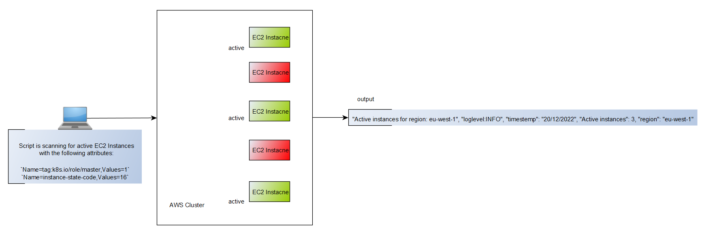

# jb-devops-final-project
The following project is part of "John Bryce DevOps seminar" - GitOps final project

The following script will scan AWS account for active EC2 instances using boto-3 library with the following attributes:

`Name=tag:k8s.io/role/master,Values=1`
`Name=instance-state-code,Values=16`

The script will print out the active instances that will be found after scan utilizing the json format library (python-json-logger).

